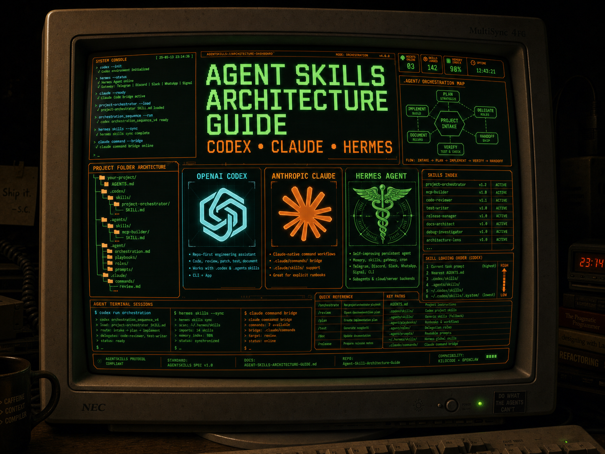

# Agent Skills Architecture Kit

Up to date (as of 5/13/26) agentic folder protocol and buildout guide for OpenAI Codex, Hermes Agent, KiloCode, Claude Code, and any AgentSkills-compatible agent. The repo features drag-and-drop agent folders with `new-skill` and `mcp-builder` skills preinstalled, plus `.agent/` orchestration examples for roles, playbooks, reusable prompts, and handoff workflows.
📄 Get the Full Guide
[Download the Agent Skills Architecture Guide (PDF)] — covers Codex-first folder structure, `AGENTS.md`, `SKILL.md` anatomy, frontmatter reference, `.agent/` orchestration folders, Claude command-folder equivalents, self-hosted model config (Ollama / LM Studio), troubleshooting, and more.

> Follow [@shaneswrld_] on X

---


## 🚀 Install

### Option 1: Download and drag (easiest)
> Drop-in `.codex/`, `.agents/`, `.agent/`, `.kilocode/`, and `.claude/` folders with skills, architecture reference, and starter config — ready to use with OpenAI Codex, Hermes Agent, KiloCode, Claude Code, and any AgentSkills-compatible agent. 

1. Download this repo as a ZIP (green **Code** button → **Download ZIP**)
2. Unzip it
3. **Drag and drop the folders into your agent folder:**
   - **For OpenAI Codex:** Drag `.codex/` or `.agents/` into your project root and keep `AGENTS.md` at the root
   - **For Hermes Agent:** Use `.agent/` as the project orchestration map and install reusable skills into your Hermes skills path
   - **For KiloCode:** Drag `.kilocode/` into your project root (or use `.claude/` as fallback)
   - **For Claude Code:** Drag `.claude/` into your project root
   - **For AGENT.MD:** Drag `.agent/AGENT.MD` into your project root (or copy to your existing `.agent/AGENT.md`)
4. Done — your agent now has skills installed and ready to use

#### How to Drag & Drop MCP Skills

To add MCP skills (like the included `mcp-builder` skill) to your agent:

1. **Download this repo as a ZIP** (green **Code** button → **Download ZIP**)
2. **Unzip it** on your computer
3. **Navigate to the agent folder** you want to add MCP skills to:
   - For OpenAI Codex: `.codex/skills/` or `.agents/skills/` folder inside your project
   - For Hermes Agent: your Hermes skills folder, or a project/repo `skills/` folder when configured
   - For KiloCode: `.kilocode/skills/` folder inside your project
   - For Claude Code: `.claude/skills/` folder inside your project
4. **Drag and drop the skill folder** (e.g., `new-mcp-builder/` from `.agent/skills/new-mcp-builder/`) into your agent's `skills/` folder
5. **Restart your agent** — the MCP skill will now be available

> **Note:** The `new-mcp-builder` skill is located at:
> - `.agent/skills/new-mcp-builder/` (generic / Hermes orchestration reference)
> - `.kilocode/skills/new-mcp-builder/` (KiloCode)
> - `.claude/skills/new-mcp-builder/` (Claude Code)

#### How to Drag & Drop AGENT.MD

To add the AGENT.MD configuration file to your project:

1. **Download this repo as a ZIP** (green **Code** button → **Download ZIP**)
2. **Unzip it** on your computer
3. **Navigate to** `.agent/` folder in the unzipped repo
4. **Drag and drop `AGENT.MD`** into your project's agent folder:
   - For Hermes Agent or generic orchestration: Drop into your project's `.agent/` folder
   - For existing `.agent/` folder: Merge with your existing AGENT.md or replace
5. **Restart your agent** — the agent configuration is now loaded

> **Tip:** If you already have an AGENT.MD file, you can merge the contents or use the included one as a template/reference.

> **Tip:** If you already have an agent folder (`.codex/`, `.agents/`, `.agent/`, `.claude/`, or `.kilocode/`), you can just drag the `skills/` subfolder into your existing agent folder to add the skills without overwriting your config. Use `.agent/playbooks/` for command-style workflows and `skills/` for reusable capabilities.

### Option 2: Clone

```bash
git clone https://github.com/shane9coy/agent-skills-kit.git

# OpenAI Codex:
cp -r agent-skills-kit/.codex/ your-project/.codex/
cp agent-skills-kit/AGENTS.md your-project/AGENTS.md

# Legacy Codex / .agents convention:
cp -r agent-skills-kit/.agents/ your-project/.agents/

# Hermes Agent / generic .agent orchestration:
cp -r agent-skills-kit/.agent/ your-project/.agent/

# KiloCode:
cp -r agent-skills-kit/.kilocode/ your-project/.kilocode/

# Claude Code:
cp -r agent-skills-kit/.claude/ your-project/.claude/
```

---

## 📁 What's Inside

```
agent-skills-kit/
├── .agent/                                # Hermes / general orchestration
│   ├── AGENT.md                          # Agent configuration and memory
│   └── skills/
│       ├── new-skill-builder/
│       │   ├── SKILL.md                   # Skill installer / scaffolder
│       │   └── references/
│       │       ├── Agent-Skills-Architecture-Guide.md
│       │       └── claude-skills-guide.md
│       └── new-mcp-builder/
│           └── SKILL.md                   # MCP builder skill
│
├── .codex/                                # OpenAI Codex
│   ├── AGENTS.md                          # Codex project memory
│   └── skills/
│       └── new-skill/
│           ├── SKILL.md
│           └── references/
│               └── claude-skills-guide.md # Architecture reference for the agent
│
├── .kilocode/                             # KiloCode
│   ├── AGENTS.md                          # KiloCode project memory (AGENTS.md standard)
│   └── skills/
│       └── new-skill/
│           ├── SKILL.md
│           └── references/
│               └── claude-skills-guide.md
│
├── .claude/                              # Claude Code
│   ├── CLAUDE.md                          # Starter project config
│   └── skills/
│       └── new-skill/
│           ├── SKILL.md                   # Skill installer / scaffolder / validator
│           └── references/
│               └── claude-skills-guide.md
│
├── .agents/                               # Legacy / generic AgentSkills
│   └── skills/
│       └── new-skill/
│           ├── SKILL.md
│           └── references/
│               └── claude-skills-guide.md
│
├── AGENTS.md                              # Codex project memory (root-level fallback)
├── README.md
└── LICENSE
```

All four folders contain compatible skills — use whichever matches your tool. For Codex-first projects, keep `AGENTS.md` at the repo root, use `.codex/skills/` or `.agents/skills/` for skills, and use `.agent/` as the human-readable orchestration map for roles, playbooks, prompts, and handoffs. KiloCode also reads `.claude/skills/` as fallback, so Claude + KiloCode users can share `.claude/`.

---

## 🛠 What `new-skill` Does

Once installed, your agent gets 5 workflows:

| # | Workflow | How to trigger |
|---|---------|---------------|
| 1 | **Create a skill from scratch** | "create a new skill for X" |
| 2 | **Install from GitHub / zip / markdown** | "install this skill: \<url\>" |
| 3 | **Install the MCP Builder skill** | "set up the mcp-builder skill" |
| 4 | **Validate a skill** | "check if my skill is set up correctly" |
| 5 | **Audit entire agent folder** | "scan and fix my .codex/.agents/.agent structure" |

---

## 🔀 Compatibility

The [AgentSkills spec](https://github.com/anthropics/skills) is a shared standard. This kit works with:

| Tool | Agent folder | Skill folder | Memory file |
|------|-------------|-------------|-------------|
| **OpenAI Codex** | `.codex/` | `.codex/skills/` (also reads `.agents/skills/`) | `AGENTS.md` |
| **Hermes Agent** | `.agent/` as orchestration map | Hermes skills path / project `skills/` when configured | `AGENTS.md` / context files |
| **KiloCode** | `.kilocode/` | `.kilocode/skills/` (also reads `.claude/skills/`) | `AGENTS.md` (reads `CLAUDE.md` as fallback) |
| **Claude Code** | `.claude/` | `.claude/skills/` | `CLAUDE.md` |
| **OpenCode** | `.opencode/` | `.opencode/skills/` (also reads `.claude/skills/`) | — |
| **Cursor / Windsurf / Cline** | `.claude/` | `.claude/skills/` via openskills | — |
| **Any AgentSkills agent** | `.agents/` | `.agents/skills/` | — |

KiloCode also supports **mode-specific skills** — drop skills into `skills-code/`, `skills-architect/`, `skills-debug/`, etc. to scope them to specific agent modes.

---

## 📖 Key Concepts (from the PDF guide)

- **AGENTS.md** — durable Codex repo instructions: stack, conventions, architecture boundaries, testing bar, and handoff expectations.
- **SKILL.md** — the only required file. YAML frontmatter (`name` + `description`) for discovery, markdown body for instructions.
- **.agent/** — project orchestration folder for roles, playbooks, prompts, and review gates. This is the Codex-friendly equivalent of a command/runbook layer.
- **Description is the trigger** — the model matches your request against descriptions, not the body. Put all "when to use" info in the description.
- **Progressive disclosure** — frontmatter is always loaded (~24 tokens/skill), body loads on trigger, references/ load on demand, scripts/ execute on demand.
- **Quote your descriptions** — unquoted YAML with special characters silently breaks registration.
- **Keep SKILL.md under 500 lines** — move depth to `references/`.

---

## 🤝 Credits

Compiled by **s.coy**
[@shaneswrld_](https://twitter.com/shaneswrld_) | [github.com/shane9coy](https://github.com/shane9coy)

---

## 📜 License

MIT — use it, fork it, ship it.
